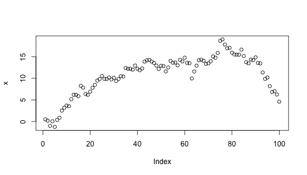

## An example Knitr/R Markdown document

[Ryan Elmore](http://rtelmore.github.io/)


### Contruct a Brownian Motion 


```r
x <- cumsum(rnorm(100))
plot(x)
```

 

The mean of this Brownian Motion is 10.8396.

### R and package versions used


```r
sessionInfo()
```

```
## R version 3.0.2 (2013-09-25)
## Platform: x86_64-apple-darwin10.8.0 (64-bit)
## 
## locale:
## [1] en_US.UTF-8/en_US.UTF-8/en_US.UTF-8/C/en_US.UTF-8/en_US.UTF-8
## 
## attached base packages:
## [1] stats     graphics  grDevices utils     datasets  base     
## 
## other attached packages:
## [1] knitrBootstrap_0.9.0 knitr_1.5           
## 
## loaded via a namespace (and not attached):
## [1] evaluate_0.5.3 formatR_0.10   markdown_0.6.4 stringr_0.6.2 
## [5] tools_3.0.2
```


